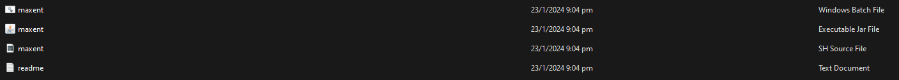
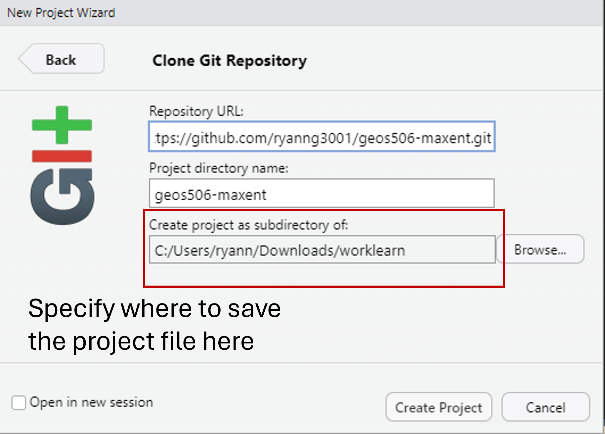
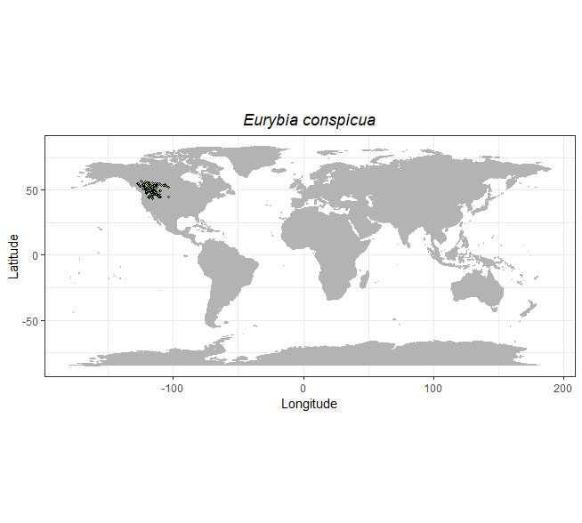

# A Quick Guide to Working with MaxEnt on R

Prepared by: Ryan Ng, Williams Lab: Plant Ecology and Biogeography, UBC Department of Geography (updated 19 March, 2024).

This document outlines a brief introduction to the use of MaxEnt for maximum entropy modeling of species geographic distribution. Specifically, we will attempt to predict the distribution of *Eurybia conspicua* (Showy Aster), a perennial herb commonly found in British Columbia and East of the Coast-Cascades Mountains.

{width="400"}

### A. Getting Started

1.  **Download Maxent**

-   Download the open-source release of MaxEnt (under MIT licence) here: <https://biodiversityinformatics.amnh.org/open_source/maxent/>.
-   After downloading, unzip the folder. You should be able to see the following files:

2.  **Install Java** (skip if you already have Java on your computer)

-   The MaxEnt software consists of a jar file, `maxent.jar`, which can be used on any computer running Java version 1.4 or later.
-   Note that we are using `maxent.jar` regardless of whether we run MaxEnt on its standalone application, or on R.
-   Install Java here (download instructions may vary depending on your OS): <http://java.sun.com/javase/downloads>.

3.  **Clone the project repository on RStudio**

-   On RStudio, click on the icon at the top right, and select **New Project \> Version Control \> Git**.
-   Under **Repository URL**, paste: <https://github.com/ryanng3001/geos506-maxent.git>.
-   Select where you want to save the project file, and click **Create Project**.
-   The repository you just cloned will contain the data needed to conduct MaxEnt.

{width="400"}

4.  **Download data and drag `data` folder into the `geos506-maxent` folder**.

5.  **Inspect the data**.

-   `eurybia-conspicua-sdm.csv` contains occurrence data for *Eurybia conspicua*. Data was obtained from GBIF, cleaned, validated and filtered for the years 1991-2020.
-   Files in `.asc` format contains predictor variables obtained from ClimateNA (1991-2020). Western North American data has a spatial resolution of 800m. Data was originally in .tiff, and converted to .asc on ArcGIS Pro.

### B. Trying out MaxEnt on the application

1.  Open `maxent.jar`.
2.  Under **Samples**, click **Browse** and locate the `eurybia-conspicua-sdm.csv` file.
3.  Under **Environmental Layers**, click **Browse** and locate the `annual_heat_moisture.asc` and `mean_annual_temp.asc` file (opening one predictor variable usually opens all, but only check the boxes for `annual_heat_moisture.asc` and `mean_annual_temp.asc`).
4.  Check the boxes for **Create Response Curves**, **Make Pictures of Predictions**, and **Do Jackknife to Measure Variable Importance**.
5.  Under **Output Directory**, select the `output-maxent-app` folder.
6.  Under **Settings**, change the **Random Test Percentage** to **25**. Doing so allocates 75% of our occurrence data to train (build) the MaxEnt model, while the remaining 25% will be used to test (validate) it. 
7.  Click on **Run**. A warning message will show stating that our occurrence point falls outside the bounding box of our environmental (predictor) data. Click **OK**, MaxEnt will automatically remove these points.
8.  After successfully running, the `output-maxent-app` folder will contain various files describing the results of the analysis. For a broad summary, open `Eurybia_conspicua.html`. Here, you will be able to view the AUC curves, habitat suitabiltiy map, and jackknife diagrams. **Note: If all things fail, a copy of the MaxEnt application output can be found under the `answer` folder.**

### C. Performing MaxEnt on R

1.  Open `maxent-script.R`. Explanations to code are commented on the script itself.

### D. References

Phillips, S. J. 2017. A Brief Tutorial on Maxent. Available from url: <http://biodiversityinformatics.amnh.org/open_source/maxent/>.
